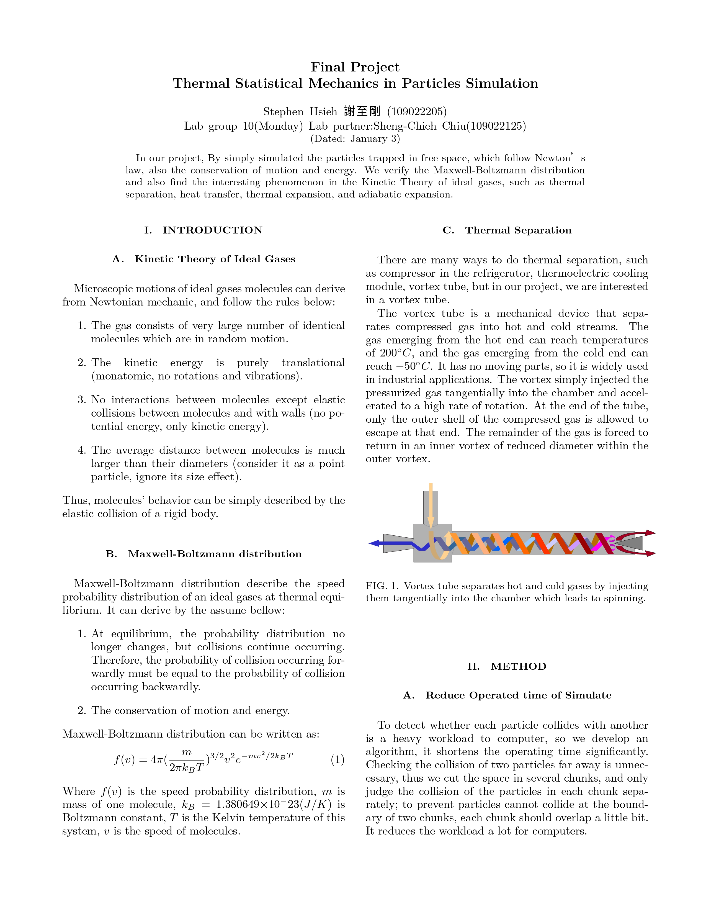
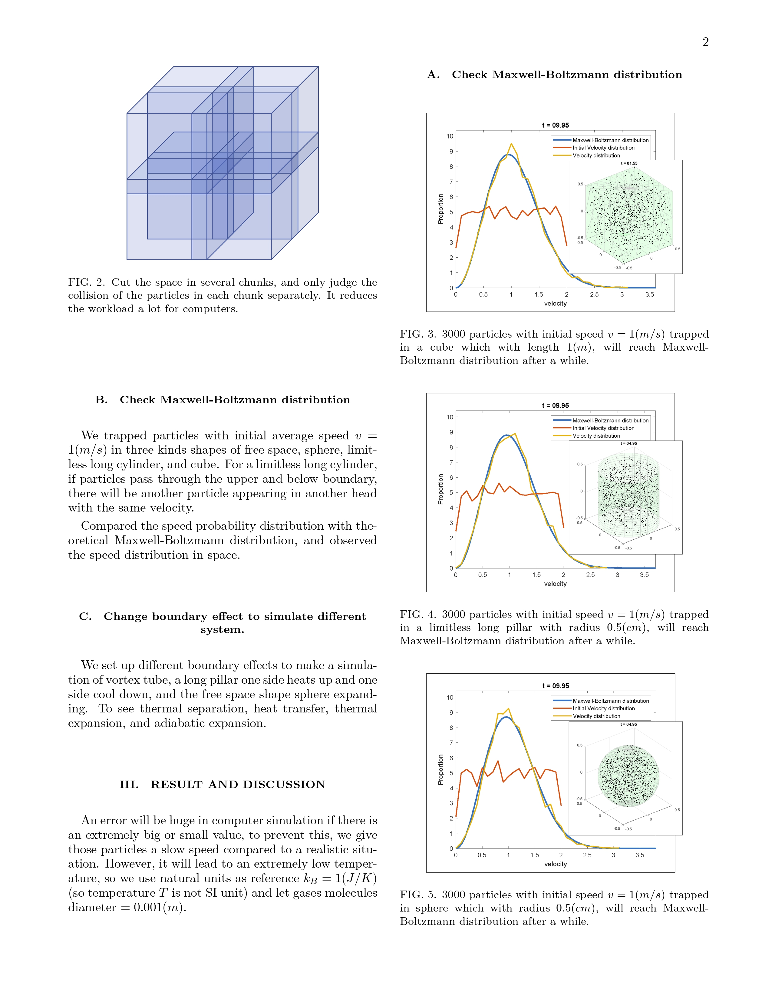
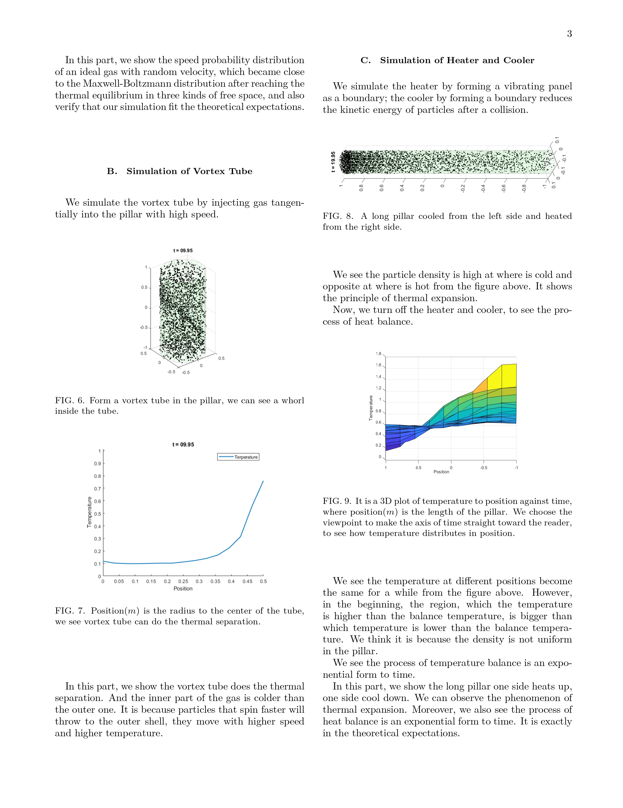
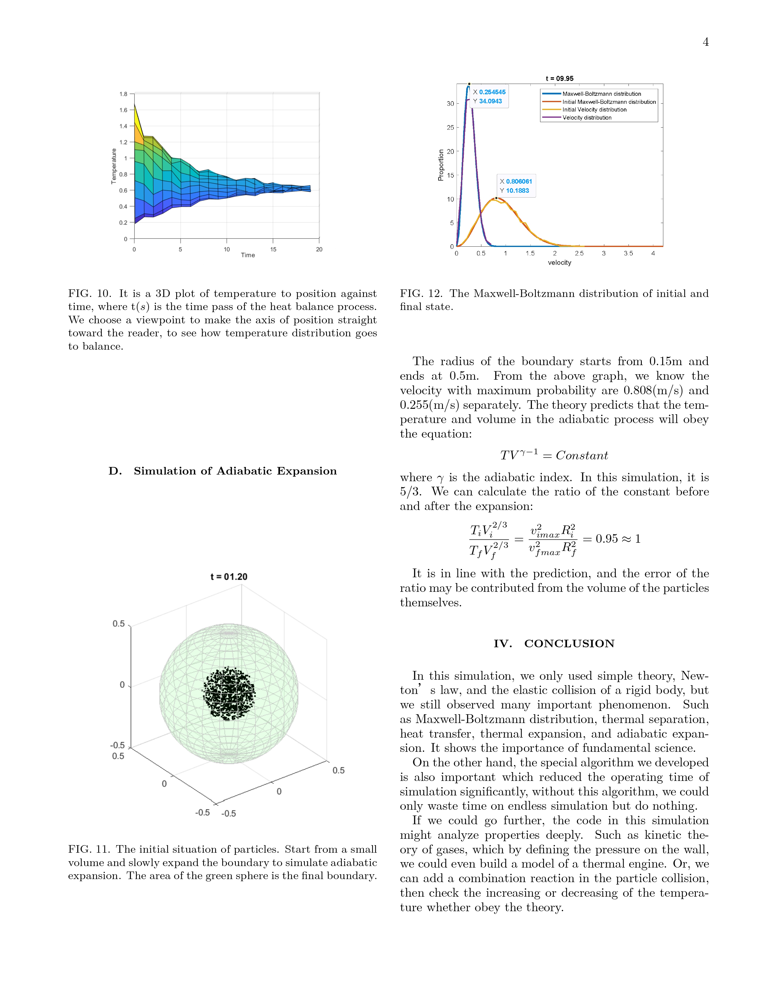
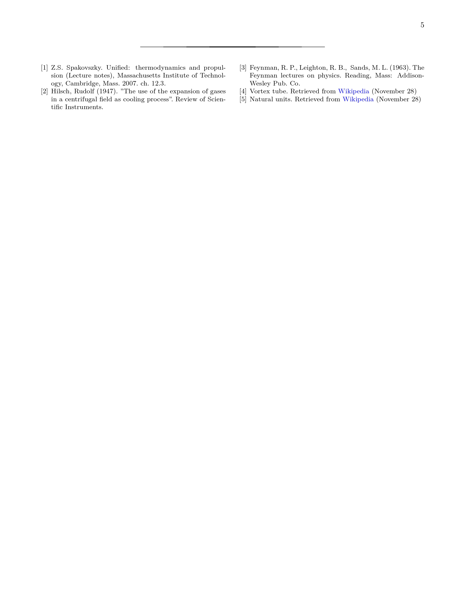

# Thermal Statistical Mechanics in Particles Simulation
## Algorithm
...
## Stimulation Video
The danamic of speed probability distribution of particles trapped in cube/sphere:  
   

The danamic of speed probability distribution of adiabatic expanding:  
   

Temperature distribution of particles trapped in long pillar when one side heat up and one side cool down:  
   

## Paper
To get the PDF paper click [Thermal_Statistical_Mechanics_in_Particles_Simulation.pdf](Thermal_Statistical_Mechanics_in_Particles_Simulation.pdf)

